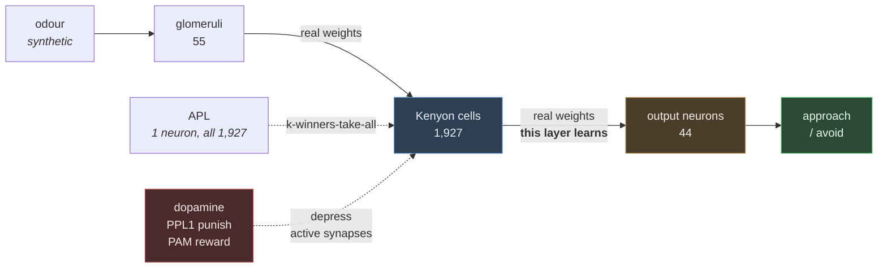

# Learning in the fly mushroom body, on real connectome wiring

Teach a fruit fly to fear a smell — then show it still doesn't care about any other smell,
and explain why. Every synapse in the circuit is measured biology, taken from the Janelia
hemibrain connectome. The whole thing is about 400 lines of Python and needs no GPU, no
account, and no dependency beyond numpy, pandas and requests.

The point is not "we simulated a brain". It is that the mushroom body implements a
computational trick — sparse random expansion coding — that computer science independently
rediscovered as locality-sensitive hashing, and you can watch it work on the real wiring.

## Run it

```bash
pip install -r requirements.txt

python 01_get_the_data.py      # 46 MB download, no login
python 02_explore.py           # find the mushroom body in 21,739 neurons
python 03_build_circuit.py     # extract the two weight matrices
python 04_odour_code.py        # sparse coding, and one honest caveat
python 05_learn.py             # teach it, then test what else changed

python 06_recognise_digits.py  # point the same circuit at pixels
python 07_draw_a_digit.py      # draw a number in a square and let it read
```

Each script narrates itself. Run them in order; they are meant to be read as much as run.

## What you get

```
--- after training ---
  odour A  -0.718  avoid [-----#----------|----------------] approach   shifted -0.883
  odour B  +0.106  avoid [----------------|-#--------------] approach   shifted -0.004

  collateral damage: odour B moved 0.5% as much as odour A
```

Six pairings move odour A from mildly attractive to clearly aversive. Odour B, never
punished, is left essentially untouched — because the two odours share only 1 of their 96
active Kenyon cells. That is one-shot learning without catastrophic interference, and it is
a direct consequence of how the connectome is wired.

The learned aversion generalises exactly as far as the codes overlap:

| similarity to the punished odour | Kenyon cell overlap | valence shift |
|---|---|---|
| 100% | 100.0% | −0.883 |
| 90%  | 91.3%  | −0.751 |
| 75%  | 66.4%  | −0.472 |
| 50%  | 32.6%  | −0.200 |
| 25%  | 11.5%  | −0.068 |
| 0%   | 4.9%   | −0.029 |

## The circuit



Learning is one line of arithmetic, and it only ever weakens synapses:

```python
kc_to_mbon[active_kenyon_cells, punished_compartment] *= (1 - rate)
```

Three factors have to coincide — the Kenyon cell fired, the output neuron sits in a
compartment receiving dopamine, and dopamine is present. No error signal travels backwards.
Punishment depresses the *approach*-promoting outputs, so the fly learns to avoid a smell by
unlearning its attraction to it.

## The same circuit, reading digits

Steps 6 and 7 test whether any of this is actually about smell. The mushroom body is a
classifier that happens to be *wired* for odours — nothing in its architecture is chemical.
So the odour input is swapped for pixels and **nothing else changes**: same connectome, same
sparsening, same depression-only learning rule, `flylab/model.py` untouched.

The fly has 55 glomeruli and an 8×8 digit has 64 pixels. The left column of a digit raster is
exactly zero across all 1,797 samples, so dropping the nine least informative pixels keeps
99.997% of the variance and leaves one pixel driving one glomerulus.

```
TEST ACCURACY  92.8%   (chance would be 10%)
```

One training pass, well under a second. scikit-learn supplies the data and the scoring and
trains nothing — every prediction comes out of the fly.

**Both dopamine systems are needed.** The fly has two: PPL1 signals punishment and teaches
the compartments whose outputs promote approach, PAM signals reward and teaches the ones that
promote avoidance. Both act by depression; only the target differs. An earlier version used
punishment alone and left about eight points on the table:

| | validation accuracy |
|---|---|
| punishment only (PPL1) | 84.1% |
| **punishment + reward (PPL1 + PAM)** | **91.9%** |

Each is scored at its own best depression rate — punishment alone prefers a far gentler one,
so a shared rate would have rigged the comparison.

**One epoch still beats more.** Depression only ever removes weight, so repeated exposure
erodes the differences it built. The circuit learns in one shot or not at all.

Errors are explained by the same overlap metric as the odour work: digits 1 and 8 share 88%
of their Kenyon cell code, and 3 and 9 share 82%.

**Method note:** the data is split three ways and anything tuned is tuned on validation, with
the test split scored once at the end. An earlier version of this project tuned sparsity
against the test set and reported an optimistically biased 84.2%.

**What the circuit learned is saved separately from its wiring.** `data/circuit.npz` holds
the connectome — fixed, measured, never trained. `data/digit_memory.npz` (37 KB) holds the
two readouts, which is the part that changed through experience. Step 7 recalls that memory
rather than relearning on every launch.

`07_draw_a_digit.py` opens a square canvas and shows, next to your drawing, the 8×8 image the
circuit actually receives. That preview is the point — a digit that looks fine to you can
still arrive unrecognisable, and the preview shows it immediately instead of leaving you
guessing at a wrong answer. Drawings are cropped, centred and reduced to a 32×32 binary
bitmap then summed in 4×4 blocks, reproducing how the training data was originally built.

**Verified headlessly, not by hand:** driving the real `DigitPad` class with synthetic
strokes classifies correctly (vertical line → 1, seven-shape → 7, ellipse → 0), and position
and stroke weight provably cannot change the answer. The interactive canvas has not been
driven with a real mouse.

## What is real and what is modelled

Being clear about this is most of the value, because the gap is where this field currently
lives.

**Measured, straight from the connectome**

- Both weight matrices: glomerulus → Kenyon cell (55 × 1,927) and Kenyon cell → MBON (1,927 × 44)
- 1,927 Kenyon cells, 6.0 glomeruli each on average — published expectation is ~6–7 (Caron et al. 2013)
- APL contacting every one of the 1,927 Kenyon cells
- Which compartment each output and dopaminergic neuron belongs to

**Derived, then checked against published work**

- Approach vs avoid. Rather than hardcoding a valence table, it is derived from which
  dopamine cluster teaches each compartment (Aso et al. 2014). `03_build_circuit.py` then
  checks the derivation against three documented cases and reports any disagreement instead
  of overriding it.

**Modelled, and not in the data**

- **Odours are synthetic.** Real wiring, invented smells. Measured odour-to-glomerulus maps
  are a separate dataset and the result does not depend on them.
- **Kenyon cell gain normalisation.** This is the honest caveat, and `04_odour_code.py`
  demonstrates it rather than hiding it. Total input weight per Kenyon cell ranges from 0 to
  254 synapses, so without normalisation the same high-gain cells win every competition and
  unrelated odours share 34% of their code against a 5% chance level. Flies do not have this
  problem because firing thresholds scale with typical drive — but the connectome records
  synapse counts, not thresholds, so that has to be put back by hand.
- A firing-rate model, not spiking. No APL dynamics, no dopamine timing, no compartment
  time constants, no units in mV or ms.
- Right hemisphere only; hemibrain is a partial volume.

**The honest claim:** real measured connectivity, a published learning rule, and a
reproducible result about sparse coding. Not "we simulated a fly brain."

## Data

`https://storage.googleapis.com/hemibrain/v1.2/exported-traced-adjacencies-v1.2.tar.gz`
— 45,872,577 bytes, anonymous, CC-BY, Janelia hemibrain v1.2. Three CSVs: 21,739 typed
neurons and 3,550,403 weighted edges totalling 14,329,229 synapses.

Most connectome data needs a Google login (FlyWire Codex, neuPrint tokens, `caveclient`,
`fafbseg`) or runs to gigabytes. This does not, which is the only reason the project fits in
one sitting.

## Development

```bash
pip install -r requirements-dev.txt
lint.cmd          # ruff, flake8, pylint, mypy at 140 chars
python -m pytest  # 47 tests
```

Library code (`flylab/`) uses `logging`; the numbered scripts use `print`, because their
terminal output *is* the deliverable.

## References

- Dorkenwald et al. (2024) *Neuronal wiring diagram of an adult brain*, Nature — the complete connectome
- Scheffer et al. (2020) eLife — the hemibrain dataset used here
- Dasgupta, Stevens & Navlakha (2017) *Science* — the mushroom body as locality-sensitive hashing
- Caron et al. (2013) Nature — random PN→KC sampling
- Turner et al. (2008) J Neurophysiol — sparse odour coding
- Aso et al. (2014) eLife — compartments, and the valence organisation used here
- Hige et al. (2015) Neuron — dopamine-gated depression of KC→MBON
