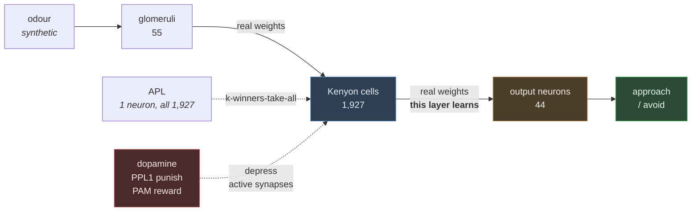
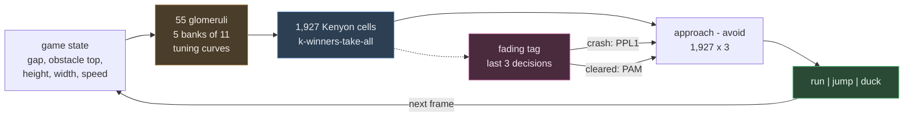

# Learning in the fly mushroom body, on real connectome wiring

Teach a fruit fly to fear a smell — then show it still doesn't care about any other smell,
and explain why. Every synapse in the circuit is measured biology, taken from the Janelia
hemibrain connectome. The whole thing is about 400 lines of Python and needs no GPU, no
account, and no dependency beyond numpy, pandas and requests.

The point is not "we simulated a brain". It is that the mushroom body implements a
computational trick — sparse random expansion coding — that computer science independently
rediscovered as locality-sensitive hashing, and you can watch it work on the real wiring.

The same circuit, unmodified, then does two more jobs: it reads handwritten digits at 93.9%,
and it learns to play Chrome's dinosaur game from nothing but crashing. The third one only
half works, which turns out to be the most informative of the three — see
[playing Dino](#the-same-circuit-playing-dino).

## Run it

```bash
pip install -r requirements.txt

python 01_get_the_data.py      # 46 MB download, no login
python 02_explore.py           # find the mushroom body in 21,739 neurons
python 03_build_circuit.py     # extract the two weight matrices
python 04_odour_code.py        # sparse coding, and one honest caveat
python 05_learn.py             # teach it, then test what else changed

python 06_recognise_digits.py  # point the same circuit at pixels
python 07_draw_a_digit.py      # draw a number in a square and let it read
python 08_export_for_web.py    # export the trained circuit for a browser

python 09_teach_the_dino.py    # no labels this time - only crashes
python 10_export_the_dino.py   # export the runner, and a parity fixture
python 11_check_the_web.py     # rebuild the digit demo's parity fixture
```

Then open `web/index.html` in a browser: a landing page for both demos, each in its own
folder and each running with no Python and no network at all.

```bash
node web/digits/verify.js      # the browser reads the same digits as Python
node web/dino/verify.js        # the browser plays the identical game, frame for frame
```

Each script narrates itself. Run them in order; they are meant to be read as much as run.

## What you get

```
--- after training ---
  odour A  -0.718  avoid [-----#----------|----------------] approach   shifted -0.883
  odour B  +0.106  avoid [----------------|-#--------------] approach   shifted -0.004

  collateral damage: odour B moved 0.5% as much as odour A
```

Six pairings move odour A from mildly attractive to clearly aversive. Odour B, never
punished, is left essentially untouched — because the two odours share only 1 of their 96
active Kenyon cells. That is one-shot learning without catastrophic interference, and it is
a direct consequence of how the connectome is wired.

The learned aversion generalises exactly as far as the codes overlap:

| similarity to the punished odour | Kenyon cell overlap | valence shift |
|---|---|---|
| 100% | 100.0% | −0.883 |
| 90%  | 91.3%  | −0.751 |
| 75%  | 66.4%  | −0.472 |
| 50%  | 32.6%  | −0.200 |
| 25%  | 11.5%  | −0.068 |
| 0%   | 4.9%   | −0.029 |

## The circuit



Learning is one line of arithmetic, and it only ever weakens synapses:

```python
kc_to_mbon[active_kenyon_cells, punished_compartment] *= (1 - rate)
```

Three factors have to coincide — the Kenyon cell fired, the output neuron sits in a
compartment receiving dopamine, and dopamine is present. No error signal travels backwards.
Punishment depresses the *approach*-promoting outputs, so the fly learns to avoid a smell by
unlearning its attraction to it.

## The same circuit, reading digits

Steps 6 and 7 test whether any of this is actually about smell. The mushroom body is a
classifier that happens to be *wired* for odours — nothing in its architecture is chemical.
So the odour input is swapped for pixels and **nothing else changes**: same connectome, same
sparsening, same depression-only learning rule, `flylab/model.py` untouched.

The fly has 55 glomeruli and an 8×8 digit has 64 pixels. The left column of a digit raster is
exactly zero across all 1,797 samples, so dropping the nine least informative pixels keeps
99.997% of the variance and leaves one pixel driving one glomerulus.

```
TEST ACCURACY         93.9%   (chance would be 10%)
SAME DIGITS, REDRAWN  79.7%   (what the drawing pad and browser demo hit)
```

One training pass, well under a second. scikit-learn supplies the data and the scoring and
trains nothing — every prediction comes out of the fly.

**Both dopamine systems are needed.** The fly has two: PPL1 signals punishment and teaches
the compartments whose outputs promote approach, PAM signals reward and teaches the ones that
promote avoidance. Both act by depression; only the target differs. An earlier version used
punishment alone and left about eight points on the table:

| | validation accuracy |
|---|---|
| punishment only (PPL1) | 84.1% |
| **punishment + reward (PPL1 + PAM)** | **91.9%** |

Each is scored at its own best depression rate — punishment alone prefers a far gentler one,
so a shared rate would have rigged the comparison.

**One epoch still beats more.** Depression only ever removes weight, so repeated exposure
erodes the differences it built. The circuit learns in one shot or not at all.

**Freehand digits are a harder problem than the dataset.** A drawn stroke is thicker and
harder-edged than the scanned digits, so it lands outside the distribution the circuit was
taught on — 79.7% rather than 93.9%. Two things close most of that gap. The drawing is framed
the way optdigits frames its digits: every source digit spans all eight rows and none spans
all eight columns, so a drawing is scaled to fill the height with its own proportions intact.
Squaring it instead widens every digit by about a third, which is enough to close the loop of
a 6 into an 8 — that one bug made 6 fail consistently. And `digits.augment` trains the circuit
on drawn-style copies alongside the originals, which costs about a point on the clean set to
gain twelve on drawn input.

Errors are explained by the same overlap metric as the odour work: digits 1 and 8 share 88%
of their Kenyon cell code, and 3 and 9 share 82%.

**Method note:** the data is split three ways and anything tuned is tuned on validation, with
the test split scored once at the end. An earlier version of this project tuned sparsity
against the test set and reported an optimistically biased 84.2%.

**What the circuit learned is saved separately from its wiring.** `data/circuit.npz` holds
the connectome — fixed, measured, never trained. `data/digit_memory.npz` (37 KB) holds the
two readouts, which is the part that changed through experience. Step 7 recalls that memory
rather than relearning on every launch.

`07_draw_a_digit.py` opens a square canvas and shows, next to your drawing, the 8×8 image the
circuit actually receives. That preview is the point — a digit that looks fine to you can
still arrive unrecognisable, and the preview shows it immediately instead of leaving you
guessing at a wrong answer. Drawings are cropped, scaled to fill the height with their own
proportions kept, and reduced to 8×8 by summing fractional ink coverage in 4×4 blocks —
matching how the source digits are framed and shaded.

**Verified headlessly, not by hand:** driving the real `DigitPad` class with synthetic
strokes classifies correctly (vertical line → 1, seven-shape → 7, ellipse → 0), and position
and stroke weight provably cannot change the answer. The interactive canvas has not been
driven with a real mouse.

## The same circuit, playing Dino

Both tasks so far hand the circuit a teaching signal at the exact moment the Kenyon cells
fire: a shock paired with an odour, a label attached to a digit. A game gives you neither.
Nobody says which key was right, the only feedback is a crash, and by the time it arrives the
decision that caused it is some twenty frames in the past.

The fly's own answer to that is a fading tag. A Kenyon cell that has just fired stays eligible
for a while, so dopamine arriving late still finds something to act on. That is the entire
addition here, and it needs no new mathematics: decisions are remembered as they are made, and
an outcome replays the last few of them into the same `model.depress` used for odours and
digits, weighted by how recent each one was. Clearing an obstacle is reward and weakens the
*avoidance* of what was just done; crashing is punishment and weakens the *approach* to it.



**Game state reaches the circuit the way a smell would.** Five quantities, each driving a bank
of eleven glomeruli tuned to preferred values along its range — which is what a labelled-line
sensory layer is. Five banks of eleven is exactly the 55 glomeruli the connectome provides.
Feeding five raw numbers instead does not work, and for a specific reason: sparse expansion
coding needs a high-dimensional input to hash usefully, and five numbers produce codes that
barely differ between neighbouring states.

**One number here is not in the connectome.** Depression only ever removes weight. Over a
thousand digits that is fine, which is why the classifier needs nothing else, but a run of
Dino makes hundreds of thousands of updates and every synapse would decay to zero, leaving the
readout flat. `FlyPilot.recover` relaxes weights back toward baseline, which turns each synapse
into a moving average of how often that action was punished in that state. Flies do forget —
memory decay and extinction are both measured — but the connectome records no such rate, so
this one is chosen, not derived.

**It works, and not very well.** Median frames survived over 100 runs it never trained on:

| | median | mean | best |
|---|---|---|---|
| do nothing | 139 | 142 | 236 |
| act at random | 148 | 168 | 362 |
| always jump | 159 | 173 | 512 |
| **the taught circuit** | **176** | **219** | **702** |
| a hand-written policy | 3,000 | 3,000 | 3,000 |

That is a real effect and a weak one. The scripted policy survives the 3,000-frame cap on every
seed, so the ceiling is not the game. Across five training seeds the circuit's median ranges
from 161 to 541 — so any single number from this task is mostly noise, and an earlier draft of
the spec quoted 707 from a lucky seed before that was caught. Unlike the digit task, the second
dopamine system does not clearly help here either: 176 against 163, which is inside that spread.

What it learned is legible, which is more interesting than the score:

```
                 0   50  100  150  200  250  300  350  400  500   <- gap in pixels
  short cactus run  JUMP JUMP JUMP JUMP JUMP run  JUMP JUMP duck
  low bird     run  run  run  JUMP run  run  run  run  run  run
  middle bird  run  run  run  run  run  run  run  run  run  run
```

Cacti are half-right — it jumps, roughly in the right band, smeared wider than the 150–300
window that actually works. Birds are unlearned: the low one should be ducked and the middle
one jumped, and it does neither.

**The limit is the encoding, not the learning rule.** A cactus 150 pixels away and one 400 away
share **65%** of their Kenyon cell code, and those two states need opposite actions. Obstacle
*type* separates cleanly — a cactus and a low bird at the same distance share only 11% — but
*distance* does not, and distance is what jumping is about. Every failure traces back to that
number, including the one below. Spending more of the 55 glomeruli on the gap is the obvious
next move and has not been tried.

**One finding worth keeping.** The training loop ignores what happens during a jump. Since a
jump lasts 34 frames, most obstacles are both cleared and crashed into while airborne, so this
looks exactly like a bug — it was found, fixed, and covered with tests before being measured.
Measured across five seeds, the fix was much worse: median 150 against 267, three seeds
collapsing to chance. Because neighbouring gaps share most of their code, punishing a jump that
mistimed by ten pixels also punishes the jump that would have worked, and JUMP is extinguished
everywhere. Jumping is learned by elimination — running into things is punished, and jumping is
what survives. The behaviour is now deliberate and pinned by a test named so nobody repeats the
correction.

## The browser demos

`web/index.html` is a landing page over two self-contained demos: `web/digits/` and
`web/dino/`. Each folder holds its own page, its own port of the circuit, its own exported
model and its own parity check, so either can be opened, read or deployed without the other.
That independence is why the k-winners-take-all kernel is duplicated between
`digits/flybrain.js` and `dino/flydino.js` rather than shared; each is checked against Python
separately.

`08_export_for_web.py` writes the whole trained circuit to `data/flybrain_web.json` (0.39 MB)
and to `web/digits/model.js`, which is the same bundle as a script assignment so a page can
load it without a fetch. The circuit runs entirely in the tab — no server, no Python, no
network. The Dino demo is the same idea with `10_export_the_dino.py`, plus a vendored copy of
p5.js, which draws the game and does nothing else. It plays on demand rather than autoplaying,
steps a frame at a time if you want to read the circuit's mind, and stops when the fly crashes
so you can see what it hit.

Both pages ship every asset inline, including the sprite sheet, which arrives as a `data:` URI.
That is not tidiness: a page opened from the filesystem cannot fetch anything, so an ordinary
`loadImage("sprites.png")` leaves p5 waiting forever on a blank canvas.

It stays small because of two things. The connectome layer is only 10% dense, so it ships as
a sparse matrix; and scoring only ever uses `approach - avoid`, so the two readouts collapse
into one 1927×10 matrix before export.

`web/digits/flybrain.js` is a port of `flylab/digits.py` and `flylab/classifier.py`, and
`node web/digits/verify.js` checks it against the real Python model on cases written by
`11_check_the_web.py`. Every Kenyon cell that fires is the same cell and every verdict is the
same verdict, at zero tolerance. The 8×8 preprocessing agrees to within one float32 ulp rather
than bit-for-bit: numpy sums each 4×4 block pairwise and a JavaScript loop sums it in order,
which on fractional stroke coverage can land one ulp apart — measured at 1.5 × 10⁻⁸ on a value
of 0.18, and never enough to change a cell or a verdict.

Getting to exact took understanding one thing. Gain normalisation makes each cell's input
weights sum to one, so a cell fed only saturated pixels scores **exactly 16** — and a bold
drawing can leave three hundred cells sitting there at once, with the winner boundary inside
that group. Which of them fire was then decided by the last bits of a float64 sum, and
numpy's BLAS and a sparse row loop do not agree on those. Worse, those sums land within a few
parts in 10⁸ of 16, which is precisely the rounding midpoint of the nearest float32, so
rounding to float32 balances them on a knife edge rather than merging them.

`flylab.model.quantise` snaps the drive to a grid far coarser than the error and far finer
than any real difference, and `kwta` then breaks the genuine ties by index. Both sides do the
same, so both pick the same cells.

## What is real and what is modelled

Being clear about this is most of the value, because the gap is where this field currently
lives.

**Measured, straight from the connectome**

- Both weight matrices: glomerulus → Kenyon cell (55 × 1,927) and Kenyon cell → MBON (1,927 × 44)
- 1,927 Kenyon cells, 6.0 glomeruli each on average — published expectation is ~6–7 (Caron et al. 2013)
- APL contacting every one of the 1,927 Kenyon cells
- Which compartment each output and dopaminergic neuron belongs to

**Derived, then checked against published work**

- Approach vs avoid. Rather than hardcoding a valence table, it is derived from which
  dopamine cluster teaches each compartment (Aso et al. 2014). `03_build_circuit.py` then
  checks the derivation against three documented cases and reports any disagreement instead
  of overriding it.

**Modelled, and not in the data**

- **Odours are synthetic.** Real wiring, invented smells. Measured odour-to-glomerulus maps
  are a separate dataset and the result does not depend on them.
- **Kenyon cell gain normalisation.** This is the honest caveat, and `04_odour_code.py`
  demonstrates it rather than hiding it. Total input weight per Kenyon cell ranges from 0 to
  254 synapses, so without normalisation the same high-gain cells win every competition and
  unrelated odours share 34% of their code against a 5% chance level. Flies do not have this
  problem because firing thresholds scale with typical drive — but the connectome records
  synapse counts, not thresholds, so that has to be put back by hand.
- **The eligibility trace, in the Dino task.** That a Kenyon cell stays briefly eligible after
  firing, so late dopamine can still act on it, is real and measured — but its duration here is
  three decisions because that is what worked, not because anything in the data says so. It is
  also the single most consequential number in that task: unbounded, the circuit learned
  nothing at all.
- **Weight recovery, in the Dino task.** Depression alone drives every synapse to zero over a
  long run, so weights relax back toward baseline. Forgetting and extinction are both measured
  in flies; this particular rate is chosen.
- **The game's own timing.** Frames rather than milliseconds, and one fixed runner position.
  The Processing original's difficulty depends on the frame rate the machine achieves, which
  would make training irreproducible.
- A firing-rate model, not spiking. No APL dynamics, no dopamine timing, no compartment
  time constants, no units in mV or ms.
- Right hemisphere only; hemibrain is a partial volume.

**The honest claim:** real measured connectivity, a published learning rule, and a
reproducible result about sparse coding. Not "we simulated a fly brain."

## Data

`https://storage.googleapis.com/hemibrain/v1.2/exported-traced-adjacencies-v1.2.tar.gz`
— 45,872,577 bytes, anonymous, CC-BY, Janelia hemibrain v1.2. Three CSVs: 21,739 typed
neurons and 3,550,403 weighted edges totalling 14,329,229 synapses.

Most connectome data needs a Google login (FlyWire Codex, neuPrint tokens, `caveclient`,
`fafbseg`) or runs to gigabytes. This does not, which is the only reason the project fits in
one sitting.

**The Dino game** is ported from
[santifiorino/dino-reinforcement-learning](https://github.com/santifiorino/dino-reinforcement-learning),
a Processing sketch that teaches a population of a thousand players with a genetic algorithm.
Every constant here — the hitboxes, the jump parabola `y = 450 − 172·4t(1−t)`, the six cactus
sizes and three bird altitudes, the spawn distribution — was read from that sketch's source, and
`web/dino/sprites.png` is its sprite sheet, originally from Chromium's offline dinosaur game.

The learning shares nothing with it, which is the point of the comparison: that project evolves
a population across generations and solves the game; this one is a single circuit learning
inside one lifetime, and only half-solves it. The genetic algorithm is the stronger baseline
here, and it is worth being plain about that.

**p5.js v1.11.3** is vendored at `web/dino/p5.min.js` (LGPL-2.1). It draws the game and does
nothing else — the game's own logic never calls into it, because p5 in global mode replaces
`window.random` and one accidental call would break the parity check silently.

## Development

```bash
pip install -r requirements-dev.txt
lint.cmd          # ruff, flake8, pylint, mypy at 140 chars
python -m pytest  # 47 tests
```

Library code (`flylab/`) uses `logging`; the numbered scripts use `print`, because their
terminal output *is* the deliverable.

## References

- Dorkenwald et al. (2024) *Neuronal wiring diagram of an adult brain*, Nature — the complete connectome
- Scheffer et al. (2020) eLife — the hemibrain dataset used here
- Dasgupta, Stevens & Navlakha (2017) *Science* — the mushroom body as locality-sensitive hashing
- Caron et al. (2013) Nature — random PN→KC sampling
- Turner et al. (2008) J Neurophysiol — sparse odour coding
- Aso et al. (2014) eLife — compartments, and the valence organisation used here
- Hige et al. (2015) Neuron — dopamine-gated depression of KC→MBON
