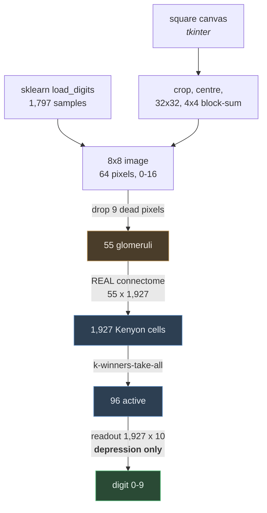

# Design: Digit recognition with the fly connectome

## Problem & goals

The mushroom body project showed the circuit learning odours. But the mushroom body is a
classifier that happens to be *wired* for smell — nothing in its architecture is chemical.
If sparse expansion coding is a general computational trick rather than an olfactory
specialisation, the same circuit should classify inputs that are not odours at all.

Goal: feed the circuit pixels instead of glomerular activation, change nothing else, and
measure what happens. Then draw a digit by hand and have it read live.

Non-goal: competitive accuracy. A linear model on this dataset reaches ~95%; the question
here is whether a biological circuit with a depression-only learning rule works at all.

## Requirements / constraints

- The expansion layer must remain the measured connectome, not a random matrix.
- `flylab/model.py` must be reused unmodified — if the odour scripts break, the claim of
  generality is false.
- scikit-learn supplies data and metrics only; it must not train anything.
- Hand-drawn input must reach the circuit the same way training data did.

## Proposed approach

**Pixels to glomeruli.** The fly has 55 glomeruli and an 8×8 digit has 64 pixels. Measured
per-pixel variance shows the left column of the raster is *exactly* zero across all 1,797
samples, so dropping the nine least informative pixels retains 99.997% of the variance and
leaves one pixel driving one glomerulus. Variance is measured on the training split only.

**Learning.** The readout starts as all ones, so no class is distinguishable from any other.
For a sample labelled `y`, the active Kenyon cells' synapses onto every *wrong* class are
depressed — which is exactly the existing `model.depress` signature with `targets` being
`ones(10)` with `y` cleared. Prediction is `argmax(code @ readout)`. All discrimination is
carved out by weakening, never strengthening.

**Canvas preprocessing** reproduces how optdigits was originally built: crop to the ink,
pad to square, reduce to a 32×32 binary bitmap, then sum each 4×4 block for values 0–16.
Skipping this is the classic reason hand-drawn digits fail against a good classifier.

## Alternatives considered

| Option | Why not |
|---|---|
| Random 64→55 projection | Works, but invents a matrix when a measured justification exists. Kept as a documented fallback if the variance assumption had failed |
| Train an sklearn classifier | Explicitly rejected: the point is that the fly does the learning |
| MNIST 28×28 | 784 pixels into 55 glomeruli needs a real projection and loses the one-pixel-one-glomerulus clarity; also a download |
| Gradient descent on the readout | Would work better, but abandons the biological rule that makes the result interesting |
| Per-sample input normalisation | Measured as a no-op — k-winners-take-all is already scale invariant |

## Open questions

- **8 is the weak class (46%).** It shares 83% of its code with 1. Whether that is inherent
  to 8×8 rasters or an artifact of the encoding is untested.
- **One epoch beats three.** Depression-only saturates, so repeated exposure erodes the
  differences it built. A decay or renormalisation term might allow multi-epoch training.
- **Only the readout learns.** The connectome layer is fixed, as in the fly. Whether
  adapting it would help is unknown and would depart from the biology.
