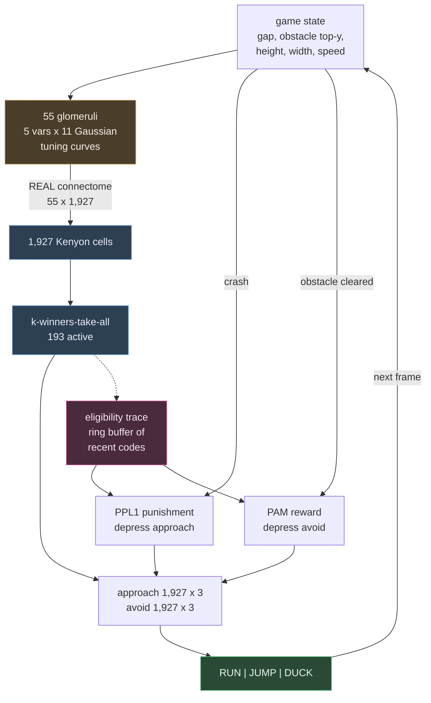

# Design: Learning to play Dino with the same circuit

## Problem & goals

The odour project taught the circuit to fear a smell. The digit project showed the same
circuit classifies pixels. Both are **supervised and instantaneous**: a label is present at
the same moment as the Kenyon cell code, and one pass over the data is the whole of learning.

Playing Dino is neither. There is no label — only a crash. The crash arrives roughly thirty
frames after the decision that caused it. And an episode is tens of thousands of decisions,
where the digit task was one pass over a thousand samples.

Goal: keep `flylab/model.py` unmodified, and find out whether dopamine-gated depression can
learn **control**, not just recognition. If it can, the claim the README already makes about
sparse expansion coding being a general trick extends from classification to action selection:
the Kenyon cell code becomes a locality-sensitive hash of *game state*, which is precisely the
state aggregation that makes value learning tractable in a continuous space.

Non-goal: beating the genetic algorithm in the source repository. A GA over 1,000 agents with
16 free parameters each is a strong baseline for a task this small. The question is whether a
single fly, learning within one lifetime from its own deaths, gets anywhere at all.

## Requirements / constraints

- `flylab/model.py` must be reused unmodified. It has survived three tasks now; breaking it
  for the fourth would forfeit the generality claim it exists to support.
- The expansion layer must remain the measured connectome.
- Training must be reproducible from a seed. The Processing original is not — its difficulty
  depends on the frame rate the machine happens to achieve.
- The browser demo must be provably identical to the Python it was trained in, to the same
  standard the digit demo already meets: zero action mismatches, 100% winner-set overlap.

## Proposed approach

**Game state to glomeruli.** Five continuous quantities describe everything the agent needs:
the gap to the next obstacle, its top edge, its height, its width, and the game speed. Each
drives eleven glomeruli tuned to preferred values along its range, which is what a labelled-line
sensory layer is. Five times eleven is exactly the 55 glomeruli the connectome provides.

The alternative — feeding five raw scalars — fails for a specific reason: sparse expansion
coding needs a high-dimensional input to hash usefully. Five numbers into 1,927 cells produces
codes that barely differ between neighbouring states, and the readout cannot separate what the
code does not.

**Delayed credit assignment is an eligibility trace.** The fly's rule is a coincidence
detector: the Kenyon cell fired *and* dopamine is present *now*. In Dino, dopamine is late.
The biology's own answer is that the synapse carries a decaying tag which dopamine acts on when
it arrives. The implementation costs no new mathematics — keep the last N sparse codes in a
ring buffer, and on a dopamine event call the existing `model.depress` once per remembered
code at `rate · λ^age`.

Dopamine fires at two discrete events, not every frame: an obstacle cleared (PAM, reward) or
a crash (PPL1, punishment). This matches how dopaminergic neurons actually behave, and it
bounds the trace naturally — the decisions relevant to obstacle *n* are exactly those taken
while obstacle *n* was the target.

**Both dopamine systems, as in the classifier.** Punishment depresses `approach` for the
action taken; reward depresses `avoid` for it. The verdict is the difference, so the score can
move either way even though each readout only ever shrinks. Both readouts start flat, so every
action scores exactly zero and an untaught fly acts at random with no special case for it.

**Recovery is the one new term.** THIS IS A MODELLING ASSUMPTION, NOT CONNECTOME DATA.
Depression only removes weight; over tens of thousands of updates every synapse decays to zero
and the readout goes flat. A slow relaxation back toward baseline — `w += recovery · (1 − w)` —
turns each synapse into an exponential moving average of how often that action was punished in
that state. It is memory decay and extinction, which are real and measured in flies, but the
connectome contains no such rate. It lives in `flylab/pilot.py`, never in `model.py`.

This is the same gap `docs/specs/digit-recognition/design.md` recorded as an open question:
"depression-only saturates, so repeated exposure erodes the differences it built. A decay or
renormalisation term might allow multi-epoch training."

## Alternatives considered

| Option | Why not |
|---|---|
| Evolve the readout with a GA, as the source repo does | Faithful to the original, but discards dopamine — the connectome becomes a fixed random projection and the story collapses to "a GA over a random feature map". Retained only as a baseline |
| Reward every surviving frame instead of per obstacle | Dense reward overwhelmingly favours whatever action is most common, and dilutes the trace across frames where nothing was at stake |
| Fixed-lag credit — blame the state N frames before the crash | Works only because this game is near-deterministic; the trace is the general form and costs the same |
| Potentiation as well as depression | Would very likely work better and there is some evidence for it at KC→MBON, but it abandons the depression-only rule that makes the result interesting |
| Run the original `.pde` in the browser via Processing.js | Deprecated since 2018; and it would be a third implementation to keep in sync, with no way to seed it identically to Python, which forfeits the parity test |
| Render the track as a bitmap and reuse `digits.to_glomeruli` | Maximum code reuse, but spends resolution on empty sky and gives poor distance precision exactly where it matters |

## Open questions

- **Will depression plus recovery converge?** This is the central bet. The fixed point is a
  bounded function of punishment frequency, which suggests yes, but it is untested.
- **How sharp should the code be?** Classification wanted 10% sparsity. Control may want
  sharper codes, since neighbouring states need different actions.
- **Is the trace the right horizon?** Discharging per obstacle is principled but the decay
  constant is not derived from anything.
- **Speed as an input.** The original's speed input is dead — `(speed - 15) / (30 - 15)` is
  Java integer division and evaluates to 0 throughout. Whether a working speed input actually
  helps is an open measurement, not an assumption.
