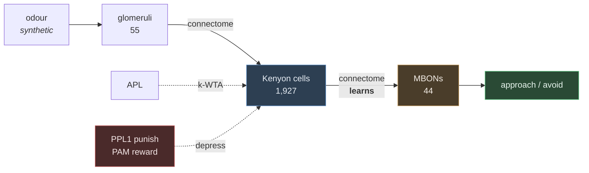

# Design: Associative learning on real mushroom body wiring

## Problem & goals

The complete adult *Drosophila* connectome was open-sourced (Dorkenwald et al., Nature,
Oct 2024) and a wave of projects is trying to use it as a computational substrate. Three
representative ones — `Chieler/flybrain`, `ornata/fly` (Fly64), `nftechie/doomfly` — share
an architecture (connectome → neural model → decode output neurons → drive a game) and none
currently demonstrates a working result: doomfly failed its own validation gates, Fly64 is
self-described as unvalidated, flybrain is blocked on dataset access. Each needs ~1.1 GB of
data and two need a compiled kernel.

Goal: a program small enough to read in one sitting that performs **real computation on real
connectome wiring** and **can be checked against published results**.

Non-goal: claiming to simulate a brain, or to run arbitrary programs on one.

## Requirements / constraints

- Real measured connectivity, not synthetic or hand-tuned wiring.
- Every quantitative claim checkable against published literature.
- No account, token, or login for data.
- Runs on a laptop in seconds; no GPU, no compiled extension.
- Teaching-first: each step readable and runnable on its own.
- Modelling assumptions stated explicitly, never silently absorbed into results.

## Proposed approach

Build the mushroom body — the fly's olfactory learning centre. It is chosen not because it
is easy to simulate but because its function is a **known computational primitive**:
Dasgupta, Stevens & Navlakha (Science, 2017) showed the circuit performs locality-sensitive
hashing through sparse random expansion coding. The same sparseness is what permits one-shot
associative learning without catastrophic interference.

**Data.** Janelia hemibrain v1.2 traced adjacencies, 45,872,577 bytes, anonymous, CC-BY.
Plain CSVs with a `type` column, which is what makes offline cell-type selection possible.

**Simulation is matrix multiplication.** A connectome is a matrix `W[i,j]` = synapses from
i to j; activity is a vector; a timestep is `f(W.T @ activity)`. No simulator framework is
needed.

**Valence is derived, not hardcoded.** Dopaminergic neurons and output neurons spell their
compartment identically in the `instance` field (`PPL101(y1pedc)_R`, `MBON11(y1pedc>a/B)_R`),
so matching them recovers the published organisation (Aso et al. 2014): punishment-taught
compartments carry approach-promoting outputs. Three literature cases are then used as a
cross-check, and disagreement is reported rather than overridden.

**Learning** is the published three-factor rule (Hige et al. 2015): a synapse weakens where
presynaptic activity, the taught compartment, and dopamine coincide. One line of numpy.

## Alternatives considered

| Option | Why not |
|---|---|
| Escape reflex (LC4/LPLC2 → Giant Fiber) | Simplest and feedforward, but demonstrates a reflex, not learning or a computational principle |
| Compass ring attractor (EPG/PEN/Delta7) | The most impressive computation, but recurrent and hand-tuned in published models; this is precisely where `Chieler/flybrain` is stuck |
| Graph exploration only | No computation, no verifiable dynamic result |
| MaleCNS v1.0 (~1.1 GB) | What the reference projects use; too heavy, and the extra coverage buys nothing for this circuit |
| FlyWire Codex / neuPrint API | Login and token gated |
| Spiking model (Brian2) | Adds a heavyweight dependency and timing parameters the connectome does not contain |

## Open questions

- **Synthetic odours.** Measured odour-to-glomerulus response maps (DoOR) would make the
  input layer real too. The computational result does not depend on them, but the demo would
  be stronger with real smells.
- **Gain normalisation.** Currently L1 per Kenyon cell. A biophysically motivated
  alternative would be modelling APL as explicit divisive feedback with a real threshold.
  The current choice is documented in `model.normalise_gain` and demonstrated in step 4.
- **Left hemisphere.** Restricted to `_R` for consistency; hemibrain's left side is partial.
- **Reward learning.** Only punishment is implemented. Reward (PAM) is derived and available
  in `mbon_valence` but no appetitive training loop exists.
